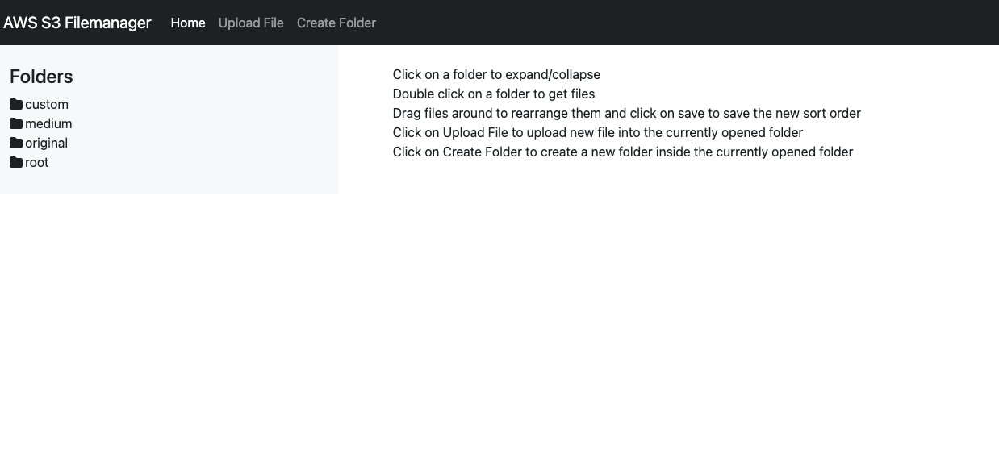

# Nodejs AWS S3 File manager with sorting capabilities

This is a simple Nodejs application that allows you to manage files in an AWS S3 bucket. It allows you to show folders and files in a bucket, create folders, upload files, and delete files. It also allows you to sort files by dragging and dropping them.

## Installation

1. Clone the repository
2. Run `npm install`
3. Copy/Rename the `.env.tmp` file to `.env` and fill in the required values
4. Run `npm start`

## Usage

The application will be running on `http://localhost:3000`. You can access the application by visiting this URL.

## Tools used

- Nodejs
- Express
- AWS SDK
- VSCode
- Github Copilot
- Sortablejs
